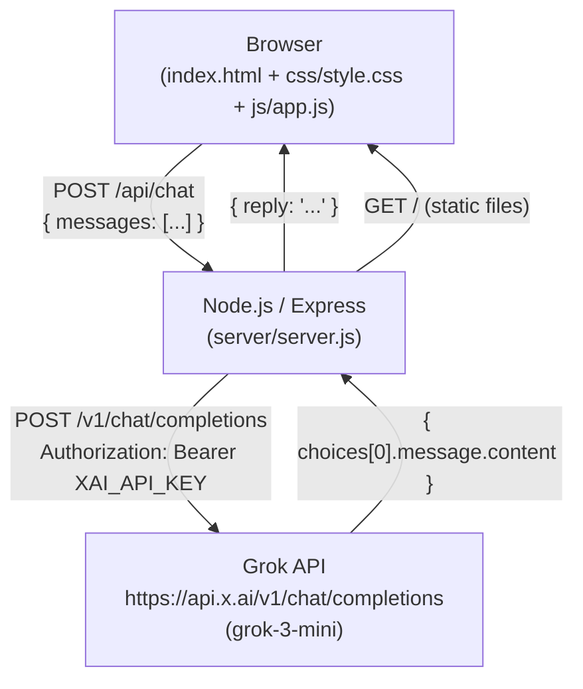

# Design Document: AI Study Buddy

## Overview

The AI Study Buddy is a lightweight, single-page web application that gives students a conversational AI tutor. The system is intentionally minimal: a static HTML/CSS/JS frontend communicates with a thin Node.js/Express backend that proxies every AI request to the Grok API (`grok-3-mini`). The backend exists solely to keep the API key out of the browser; it adds no business logic of its own.

Key design goals:
- **Zero build tooling** — plain HTML, CSS, and vanilla JS; no bundler, no framework.
- **Secure key handling** — the `XAI_API_KEY` lives only in a server-side `.env` file and is never sent to the client.
- **Stateless backend** — conversation history is owned entirely by the browser; the server is a pure pass-through.
- **Pedagogical AI behavior** — a carefully crafted system prompt enforces Socratic tutoring, quizzing, hinting, and encouragement on every turn.

---

## Architecture



**Request flow:**

1. The student types a message and presses Enter or clicks Send.
2. `app.js` appends the message to `conversationHistory` (which always starts with the system prompt) and POSTs the full array to `/api/chat`.
3. `server.js` validates the body, forwards the messages to the Grok API with the bearer token, and returns `{ reply }` or `{ error }`.
4. `app.js` appends the AI reply to `conversationHistory` and renders a new message bubble.

**Deployment topology:** Both the static frontend and the API proxy run on the same Express process on a single port (default 3000). The browser fetches `index.html` as a static asset from the same origin, so no CORS issues arise in production. The `cors` middleware is included for development convenience (e.g., running a live-reload server on a different port).

---

## Components and Interfaces

### 2.1 Backend — `server/server.js`

| Responsibility | Detail |
|---|---|
| Environment loading | `require('dotenv').config()` as the very first statement |
| Static file serving | `express.static(path.join(__dirname, '..'))` — serves project root |
| CORS | `app.use(cors())` — all origins, all methods |
| JSON body parsing | `express.json()` middleware |
| API key guard | Exits with code 1 if `XAI_API_KEY` is absent/empty |
| Chat proxy | `POST /api/chat` — validates body, calls Grok, returns reply |

**`POST /api/chat` contract:**

```
Request
  Content-Type: application/json
  Body: { messages: Array<{ role: string, content: string }> }

Response 200
  { reply: string }

Response 400
  { error: "Invalid request" }
  Condition: messages missing, empty, or any element missing role/content

Response 500
  { error: "Something went wrong" }
  Condition: Grok API network error, non-2xx status, or malformed response
```

**Grok API call shape:**

```json
{
  "model": "grok-3-mini",
  "max_tokens": 400,
  "messages": [ ...conversationHistory ]
}
```

Headers: `Authorization: Bearer <XAI_API_KEY>`, `Content-Type: application/json`.

---

### 2.2 Frontend — `js/app.js`

The entire frontend state is a single array: `conversationHistory`. All other UI state (typing indicator visibility, button disabled state) is transient and managed inline.

**Public functions / event handlers:**

| Symbol | Trigger | Behaviour |
|---|---|---|
| `sendMessage()` | Send button click, Enter key (no Shift) | Validates input, updates history, calls backend, renders reply |
| `showTyping(bool)` | Called by `sendMessage()` | Toggles `#typing-indicator` visibility and `#send-btn` disabled state |
| `appendMessage(role, text)` | Called by `sendMessage()` | Creates a message bubble div, appends to `#chat-area`, scrolls to bottom |
| `clearConversation()` | Clear button click | Resets `conversationHistory` to `[SYSTEM_PROMPT]`, clears `#chat-area` |

**Keyboard handling:** An `keydown` listener on `#user-input` calls `sendMessage()` when `event.key === 'Enter'` and `!event.shiftKey`.

**Error display:** On any non-2xx response or network failure, `appendMessage('error', 'Sorry, something went wrong. Please try again.')` is called. The error bubble is rendered but the message is **not** added to `conversationHistory`.

---

### 2.3 Frontend — `index.html`

Semantic structure:

```
<header>   — app title / branding
<main>
  <div id="chat-area">   — scrollable message history
    <div id="typing-indicator">   — hidden by default
<footer>
  <textarea id="user-input">
  <button id="send-btn">
  <button id="clear-btn">
```

All styles are in `css/style.css`. No inline `style` attributes or `<style>` blocks.

---

### 2.4 Frontend — `css/style.css`

Key layout rules:

| Rule | Value |
|---|---|
| Page background | `#F0F0F0` |
| `#chat-area` background | `#FFFFFF` |
| User bubble background | `#378ADD` |
| AI bubble background | `#F1EFE8` |
| Input bar positioning | `position: fixed` at bottom |
| `#chat-area` scroll | `scroll-behavior: smooth` |
| Typing indicator animation | CSS keyframe, 3 dots, 600 ms bounce cycle |
| Viewport meta | `width=device-width, initial-scale=1` (in HTML `<head>`) |

---

### 2.5 System Prompt

The system prompt is a constant string defined at the top of `app.js` and used as the first element of `conversationHistory`. It encodes all pedagogical rules:

1. Use simple vocabulary and short sentences suitable for a beginner.
2. Never state the answer to a homework or exam question directly, even if asked repeatedly.
3. Respond to questions with guiding questions that lead the student toward the answer.
4. Append exactly one quiz question to every explanatory response.
5. When a student's answer is incorrect, respond with a hint that narrows the problem space without revealing the answer.
6. Limit every response to a maximum of 5 sentences.
7. Conclude every response with an encouraging phrase (e.g., "You're doing great!", "Keep it up!", "You've got this!").

---

## Data Models

### 3.1 Message Object

```typescript
interface Message {
  role: "system" | "user" | "assistant";
  content: string; // non-empty
}
```

### 3.2 Conversation History

```typescript
type ConversationHistory = [SystemMessage, ...Message[]];
// Always starts with the system prompt; never empty.
```

### 3.3 API Request Body (`POST /api/chat`)

```typescript
interface ChatRequest {
  messages: Message[]; // length >= 1, each element has non-empty role and content
}
```

### 3.4 API Response Bodies

```typescript
// Success
interface ChatSuccess {
  reply: string;
}

// Error
interface ChatError {
  error: string;
}
```

### 3.5 Grok API Payload

```typescript
interface GrokRequest {
  model: "grok-3-mini";
  max_tokens: 400;
  messages: Message[];
}

interface GrokResponse {
  choices: Array<{
    message: {
      role: string;
      content: string;
    };
  }>;
}
```

---

## Correctness Properties

*A property is a characteristic or behavior that should hold true across all valid executions of a system — essentially, a formal statement about what the system should do. Properties serve as the bridge between human-readable specifications and machine-verifiable correctness guarantees.*

### Property 1: Input validation correctly classifies all request bodies

*For any* request body sent to `POST /api/chat` — whether it is missing `messages`, has an empty `messages` array, or contains any element with a missing or empty `role` or `content` — the server SHALL return HTTP 400 with `{ error: "Invalid request" }` and SHALL NOT forward the request to the Grok API. Conversely, for any non-empty array where every element has a non-empty `role` and `content`, the server SHALL forward the request and return HTTP 200.

**Validates: Requirements 3.1, 3.2**

---

### Property 2: Proxy correctness — every valid request is forwarded with the right payload and auth header

*For any* non-empty array of well-formed message objects, when the server forwards the request to the Grok API, the outgoing call SHALL use model `grok-3-mini`, `max_tokens` of `400`, the exact `messages` array provided, and an `Authorization: Bearer <XAI_API_KEY>` header matching the configured key.

**Validates: Requirements 3.3, 3.6**

---

### Property 3: Reply extraction — Grok response content is returned verbatim

*For any* successful Grok API response containing a `choices[0].message.content` string, the server SHALL return HTTP 200 with `{ reply }` whose value equals that content string exactly.

**Validates: Requirements 3.4**

---

### Property 4: Grok API failures always produce a 500 error response

*For any* failure mode of the Grok API call (network error, non-2xx HTTP status, or malformed response body missing `choices[0]`), the server SHALL return HTTP 500 with `{ error: "Something went wrong" }` and SHALL NOT propagate the raw error to the client.

**Validates: Requirements 3.5**

---

### Property 5: System prompt invariant — conversation history always starts with the system prompt

*For any* sequence of `sendMessage()` and `clearConversation()` calls (including zero calls), `conversationHistory[0]` SHALL always equal the system prompt object and `conversationHistory` SHALL never be empty.

**Validates: Requirements 6.1, 6.11**

---

### Property 6: Message round-trip — user input and AI reply are both appended correctly

*For any* non-empty input string and any successful backend reply string, after `sendMessage()` resolves: (a) `conversationHistory` SHALL contain `{ role: "user", content: trimmedInput }` appended before the fetch, and (b) `conversationHistory` SHALL contain `{ role: "assistant", content: reply }` appended after the fetch. The full `conversationHistory` (including the system prompt) SHALL be sent as the request body.

**Validates: Requirements 6.4, 6.6, 6.7**

---

### Property 7: Error responses do not mutate conversation history

*For any* backend error response (non-2xx status or `{ error }` body) and any prior conversation state, `conversationHistory` after the failed call SHALL be identical to `conversationHistory` immediately before the call. An error bubble SHALL be displayed in `#chat-area` but the error text SHALL NOT be stored in history.

**Validates: Requirements 6.8**

---

### Property 8: UI state lifecycle — typing indicator and send button are always consistent

*For any* `sendMessage()` invocation with a non-empty input: before the backend response arrives, `#typing-indicator` SHALL be visible and `#send-btn` SHALL be disabled; after the backend response is received (whether success or error), `#typing-indicator` SHALL be hidden and `#send-btn` SHALL be re-enabled.

**Validates: Requirements 4.6, 4.7, 6.5, 6.10**

---

### Property 9: Message bubble rendering contains the message text

*For any* role (`"user"` or `"assistant"`) and any non-empty content string, `appendMessage(role, content)` SHALL produce a DOM element inside `#chat-area` whose `textContent` includes the original content string, and `#chat-area.scrollTop` SHALL be set to `#chat-area.scrollHeight` after the element is appended.

**Validates: Requirements 4.1, 6.4, 6.7, 6.9**

---

## Error Handling

### Backend

| Scenario | Behaviour |
|---|---|
| `XAI_API_KEY` missing at startup | Log error, `process.exit(1)` |
| Missing / malformed request body | Return `400 { error: "Invalid request" }` |
| Grok API network error | Catch, return `500 { error: "Something went wrong" }` |
| Grok API non-2xx response | Return `500 { error: "Something went wrong" }` |
| Grok response missing `choices[0]` | Return `500 { error: "Something went wrong" }` |

All backend errors are caught in a `try/catch` around the Grok fetch call. The server never crashes on a per-request error.

### Frontend

| Scenario | Behaviour |
|---|---|
| Empty input on send | `sendMessage()` returns early; no network call |
| Backend returns `{ error }` or non-2xx | Display error bubble; do not modify `conversationHistory`; re-enable send button |
| Network failure (fetch throws) | Same as above — catch block calls `appendMessage('error', ...)` |
| Typing indicator stuck | `showTyping(false)` is called in a `finally` block so it always runs |

---

## Testing Strategy

### Unit Tests

Focus on pure logic that can be tested without a running server or browser:

- **Input validation logic** — test the validation function (or inline guard) in `server.js` with: missing `messages` key, empty array, element missing `role`, element missing `content`, element with empty string `role`, element with empty string `content`, and a valid array.
- **System prompt invariant** — test that `conversationHistory` always starts with the system prompt after initialization and after `clearConversation()`.
- **`appendMessage` output** — test that the returned DOM element has the correct CSS class for each role and that `textContent` contains the input string.
- **Error display** — test that a failed fetch results in an error bubble being appended and `conversationHistory` remaining unchanged.

### Property-Based Tests

Property-based testing is appropriate here because several behaviors must hold universally across all valid inputs (arbitrary message arrays, arbitrary content strings, arbitrary conversation lengths). The recommended library is **[fast-check](https://github.com/dubzzz/fast-check)** (JavaScript/Node.js).

Each property test runs a minimum of **100 iterations**.

Tag format: `Feature: study-buddy, Property {N}: {property_text}`

| Property | Test description | fast-check arbitraries |
|---|---|---|
| P1 — Input validation | Generate both valid and malformed request bodies; assert 200 for valid, 400 for invalid | `fc.oneof(validMessageArray, malformedBody)` — malformed variants: missing key, empty array, missing role, missing content, empty strings |
| P2 — Proxy correctness | Generate valid message arrays; mock Grok; assert outgoing call has correct model, max_tokens, messages, and Authorization header | `fc.array(fc.record({ role: fc.constantFrom('user','assistant'), content: fc.string({minLength:1}) }), {minLength:1})` |
| P3 — Reply extraction | Mock Grok to return arbitrary reply strings; assert backend returns `{ reply }` with that exact string | `fc.string({minLength:1})` for reply content |
| P4 — Grok failures → 500 | Mock Grok to fail in various ways (network error, 4xx, 5xx, missing choices); assert all return 500 | `fc.oneof(networkError, nonOkStatus, malformedBody)` |
| P5 — System prompt invariant | Generate N `sendMessage()` + `clearConversation()` calls; assert `history[0]` always equals system prompt | `fc.array(fc.string({minLength:1}))` for message sequences |
| P6 — Message round-trip | Generate arbitrary input strings and reply strings; call `sendMessage()`; assert user entry appended before fetch and assistant entry appended after | `fc.string({minLength:1})` for input; `fc.string({minLength:1})` for reply |
| P7 — Error does not mutate history | Generate arbitrary prior history; mock error backend; call `sendMessage()`; assert history unchanged | `fc.array(fc.record(...))` for initial history state |
| P8 — UI state lifecycle | Mock fetch with delay; call `sendMessage()`; assert typing indicator visible + button disabled before response, hidden + enabled after | `fc.string({minLength:1})` for input; `fc.boolean()` for success vs error response |
| P9 — Bubble rendering + scroll | Generate role + content; call `appendMessage()`; assert textContent contains content and scrollTop set to scrollHeight | `fc.constantFrom('user','assistant')`, `fc.string({minLength:1})` |

### Integration Tests

- Start the Express server with a mock `XAI_API_KEY`; send a valid `POST /api/chat` request and assert the response shape.
- Verify that the server exits with a non-zero code when `XAI_API_KEY` is absent (spawn a child process, check exit code).
- Verify that static files are served correctly (GET `/` returns 200 with HTML content).

### Manual / Smoke Tests

- Run `npm start` with a real API key; send a message; verify a reply appears.
- Verify the typing indicator appears and disappears correctly.
- Verify the Clear button resets the chat area.
- Verify the app renders without horizontal scroll at 375 px viewport width.
- Verify no API key appears in browser DevTools network requests.
